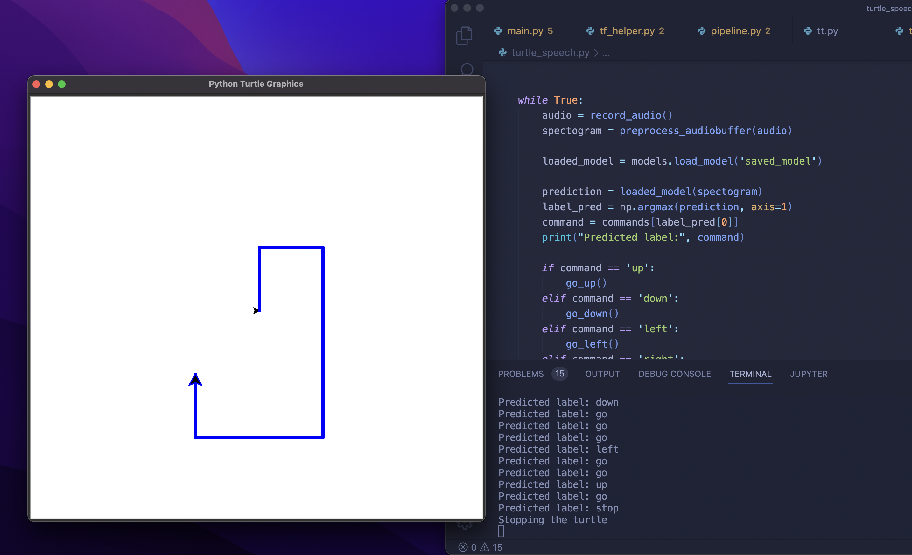

# Realtime Voice Command Recognition

Build your own real-time voice command recognition model with TensorFlow.

**Watch the video tutorial:**

## Instructions

- Run the Colab from [this TensorFlow tutorial](https://www.tensorflow.org/tutorials/audio/simple_audio)
- Follow the video to zip and download the trained model
- Make sure to use the correct `commands` order in `main.py` (same as when running the Colab)
- Install pyaudio and tensorflow
- Extraxt the zip to a folder named `saved_model`
- Run `python main.py`

## Screenshot

